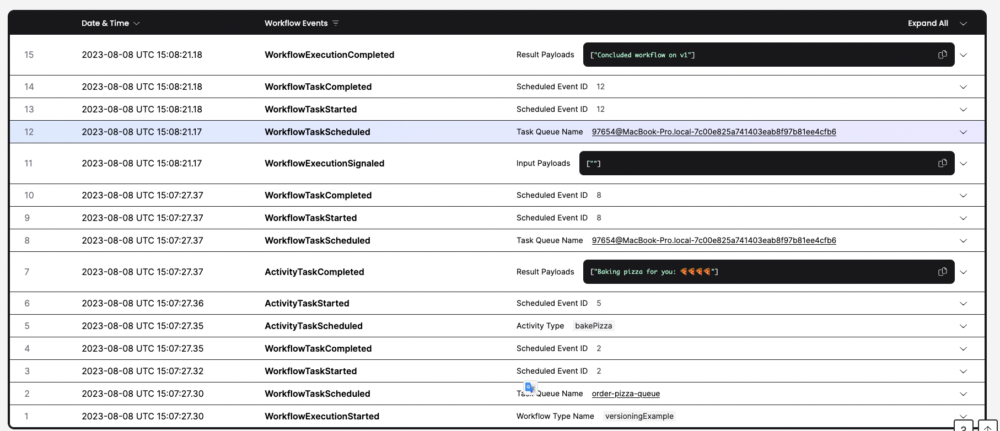
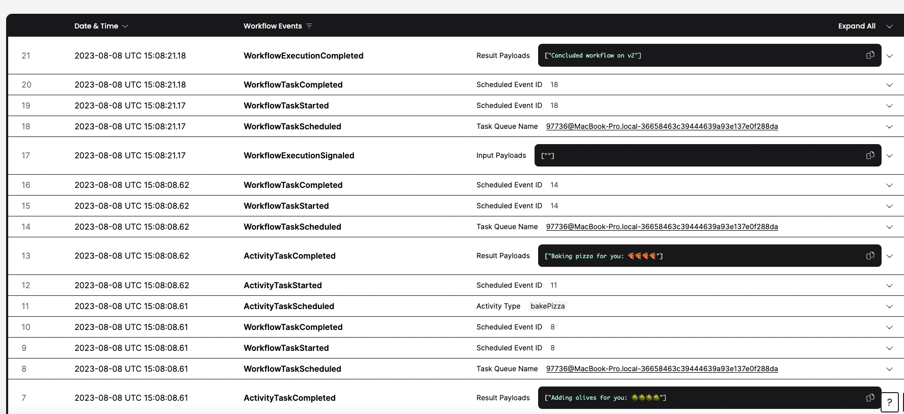

### About this repo
This repo demonstrates a work practice with temporal worker-based versioning in typescript.
If you are not familiar with temporal here is where to start: https://temporal.io/<br/>
The suggested practice in this repo is based on this article https://docs.temporal.io/workers#worker-versioning

### Problem Exploration
First let's demonstrate the problem:
In temporal Workflow must be deterministic, and the workflow function must give the same output for the same input.
The challenge now is to find a practice of how to change the workflow code without getting into NDE(Non-Deterministic Error).


# What will I learn in this repo:
1. What is NDE with a live sample
2. Suggestion for simple practice on how to avoid the problem.

### Project structure

```
commit-a/
   worker1
   workflowV1
commit-b
   worker2
   workflowV2
```
Each `commit` represents the repo before and after the change, and this project is going to demonstrate the work practice.

# How to start temporal
To start temporal run this command (between the demos please stop and start the server to clear the history)
```
$ temporal server start-dev --dynamic-config-value frontend.workerVersioningDataAPIs=true --dynamic-config-value frontend.workerVersioningWorkflowAPIs=true --dynamic-config-value worker.buildIdScavengerEnabled=true
```

# Part one the problem

First start the temporal server.

### Now let's start unversioned worker code
```
$ npm run unversioned-worker
```

Great we have a worker up and running let's order a pizza

```
$ npm run unversioned-worker
```

That's it now we have the first worker up and running let's order a pizza.

```
$ npm run pizzaClient
```
Now you expected to see 
```

[
  "Baking pizza for you: 🍕🍕🍕🍕"
]
```

In the event history, all left is to call deliverAllPizzas but before that.
Let's stop our worker
and change the code inside `src/unversioned/worker.ts` to:
```
    const worker = await Worker.create({
        workflowsPath: require.resolve('./workflows-after-change'),
        activities,
        taskQueue,
    });
```
now launch the worker again:

```
$ npm run unversioned-worker
```

and finally in order to finish the workflow

```
$ npm run deliverAllPizzas
```

Now go to the UI `http://localhost:8233/` you can see in the event history the following error:

```
Nondeterminism(\"Activity type of scheduled event 'bakePizza' does not match activity type of activity command 'addOlives'\")
```
The problem here is in the first execution of the workflow function it resulted that the first activity should be executed is `bakePizza`, however in the second execution (because of the code change ) it resulted that the first activity should be addOlives.
Since the function executed 2 times resulted in different outputs made it was not deterministic.
Now we got some understanding of the error temporal user might have on every code change of the workflow function.

* Cleanup note let's restart Temporal server and stop the worker so old stuff doesn't budder us


# Part two suggested solution

`worker-versioning` solution https://docs.temporal.io/workers#worker-versioning

Please read about it in the link below. In simple words this allows us to version the task queue and the worker.


So what is happening:

```
    await client.taskQueue.updateBuildIdCompatibility(taskQueue, {
        operation: 'addNewIdInNewDefaultSet',
        buildId: '1.0',
    });

    const worker = await Worker.create({
        workflowsPath: require.resolve('./workflowsV1'),
        activities,
        taskQueue,
        buildId: '1.0',
        useVersioning: true,
    });
```

This is our worker code:
The `updateBuildIdCompatibility` (which can be accomplished via a cli as well), is adding version `1.0` to the task queue
If we run the command:
```
$ temporal task-queue get-build-ids --task-queue order-pizza-queue
```

We'll see  the following result:

```
  BuildIds  DefaultForSet  IsDefaultSet  
  [1.0]               1.0  true         
```

There is only one version set for this task-queue and that's the default.

After we start worker2 we'll see the following result:
```
  BuildIds  DefaultForSet  IsDefaultSet  
  [1.0]               1.0  false         
  [2.0]               2.0  true     
```

Version 2 now is the default and 1 only exists for workflows that have started their execution on the old worker

### Lets see it in action

Notice!! all the code in the workflows that are related to signals ( `setHandler, defineSignal`) is not related to versioning,
the reason we use them is to create the demonstration that we have 2 workflows running in parallel and by calling the signal they both terminated at the same time 

```
`npm run worker1`
```

and order our first pizza
```
npm run pizzaClient
```

now let's start with the second worker
```
npm run worker2
```

and order our second pizza
```
npm run pizzaClient
```

Before we send our 2 waiting pizzas to delivery let's understand what is happening.

We have 2 workers running together on the same taskQueue `order-pizza-queue`.
1. worker 1 running the old workflow only `bakePizza` activity
2. worker 2 running the new workflow with `addOlives` before `bakePizza` activity.

We ordered 2 pizzas,
1. pizza 1 started its run on worker1 and finished `bakePizza`
2. pizza 2 started its run on worker2 and finished `addOlives` and `bakePizza`

What we hope to happen is that the first pizza will come back to worker 1 and second to worker 2
Now we run the final command: 

```
$ npm run deliverAllPizzas
```
This command signals all workflows to finish.


Now go to the UI at http://localhost:8233/namespaces/default/workflows and see:
One workflow concluded with  `"Concluded workflow on v1"`
And the other one `"Concluded workflow on v1"`

So the workflow that started on worker1 returned to the same worker and the other started from scratch on the newest worker( worker2)

### Workflow1


### Workflow2


To indicate that there are no workflows that need the old worker and we can stop him, we can use the following command:
```
temporal workflow list -q "BuildIds='versioned:1.0' and ExecutionStatus = 'Running' and TaskQueue = 'order-pizza-queue'"
```
